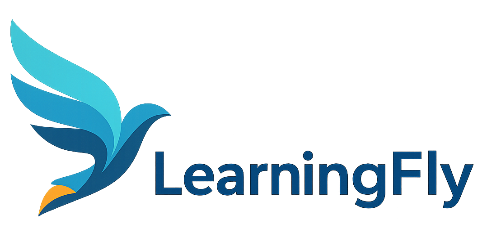
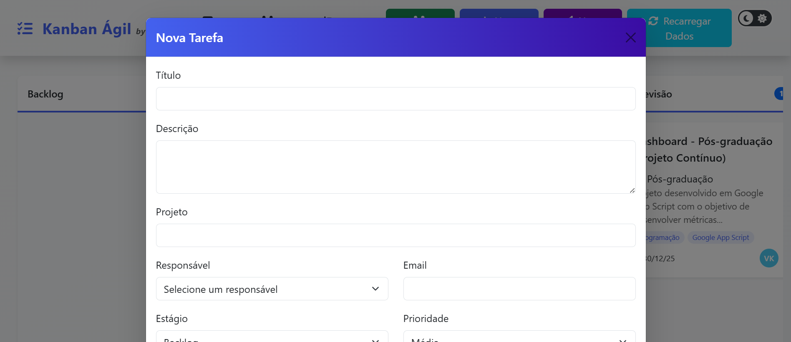
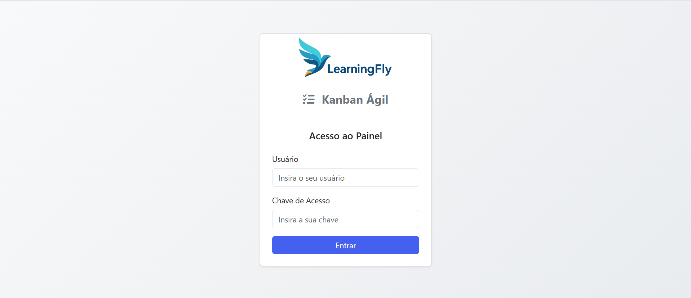

# Kanban Ágil com Google Apps Script

  

Aplicação web full-stack que implementa um quadro Kanban funcional. O backend é construído com Google Apps Script (JavaScript/V8) e o frontend com HTML/CSS/JS, utilizando bibliotecas como Bootstrap e SortableJS. A solução demonstra o uso de Google Sheets como um banco de dados NoSQL-like, além de um sistema de autenticação via token com o CacheService do Google.

  

## 🎯 Sobre o Projeto

O Kanban Ágil é uma ferramenta de gerenciamento de projetos que permite organizar tarefas em estágios (Backlog, A Fazer, Em Andamento, etc.) de forma visual e intuitiva. Ele foi desenvolvido para ser uma solução de baixo custo, segura e altamente personalizável, ideal para equipes pequenas e projetos pessoais.

Este projeto faz parte do projeto **LearningFly**, uma aplicação web desenvolvida com Google Apps Script, criada para auxiliar na gestão inteligente de cursos, materiais didáticos e fluxos educacionais. A ferramenta integra-se ao Google Workspace (Drive, Planilhas, Documentos) para tornar processos pedagógicos mais organizados, eficientes e automatizados. [Clique aqui](https://github.com/vitorkrewer/learning-fly-gapps) e conheça outros módulos do projeto em desenvolvimento.

O projeto foi idealizado e desenvolvido por **Vitor Krewer**, unindo tecnologia, design instrucional e pensamento sistêmico para resolver desafios reais de equipes que trabalham na educação digital.

## ✨ Funcionalidades Principais

* **Autenticação de Usuário:** Tela de login segura para acesso restrito.
* **Quadro Dinâmico:** Crie, edite e mova tarefas com uma interface de arrastar e soltar (drag-and-drop).
* **Visualização Detalhada:** Clique em uma tarefa para ver todos os detalhes, incluindo histórico de alterações.
* **Mural de Avisos:** Comunique informações importantes para a equipe.
* **Gerenciamento de Usuários:** Adicione e gerencie os usuários da aplicação.
* **Tema Escuro/Claro:** Interface adaptável à preferência do usuário.
* **Otimizado para Performance:** Carregamento de dados inicial em uma única requisição.

  

## 🛠️ Tecnologias Utilizadas

* **Backend:** Google Apps Script (`code.gs`)
* **Banco de Dados:** Google Sheets
* **Frontend:** HTML, CSS, JavaScript
* **Bibliotecas:** Bootstrap 5, Font Awesome, SortableJS, Moment.js

## 🚀 Como Configurar e Usar

1.  **Crie uma cópia** deste projeto de Apps Script na sua conta Google.
2.  **Crie uma nova Planilha Google** que servirá como banco de dados.
3.  **Configure o Backend:**
    * No arquivo `code.js`, insira o ID da sua planilha na variável `SPREADSHEET_ID`.
    * No arquivo `setupUserKeys.js`, defina os nomes de usuário e chaves de acesso.
    * Execute a função `setupUserKeys` uma vez pelo editor do Apps Script.
4.  **Implante o Projeto:**
    * Clique em "Implantar" > "Nova implantação".
    * Selecione o tipo "App da Web".
    * Em "Executar como", selecione "Eu".
    * Em "Quem pode acessar", selecione "Qualquer pessoa".
    * Clique em "Implantar" e autorize as permissões.
5.  **Acesse a URL** fornecida e use as credenciais que você configurou.

## 📄 Licença

Este projeto está licenciado sob os termos da [Creative Commons Atribuição-NãoComercial 4.0 Internacional (CC BY-NC 4.0)](https://creativecommons.org/licenses/by-nc/4.0/).

Você pode usá-lo, modificá-lo e compartilhá-lo **para fins não comerciais**, desde que com a devida atribuição a **Vitor Krewer**.  
Para qualquer uso comercial, entre em contato diretamente.

---

## 🤝 Contato

[LinkedIn](https://www.linkedin.com/in/vitorkrewer) • [Email](mailto:vitormkrewer@gmail.com)

---
